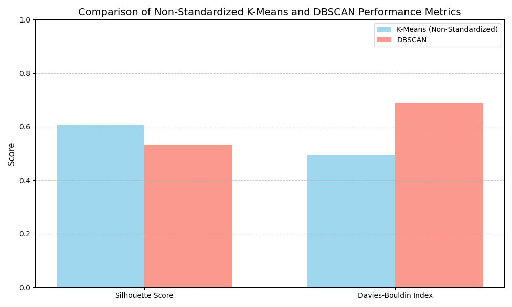
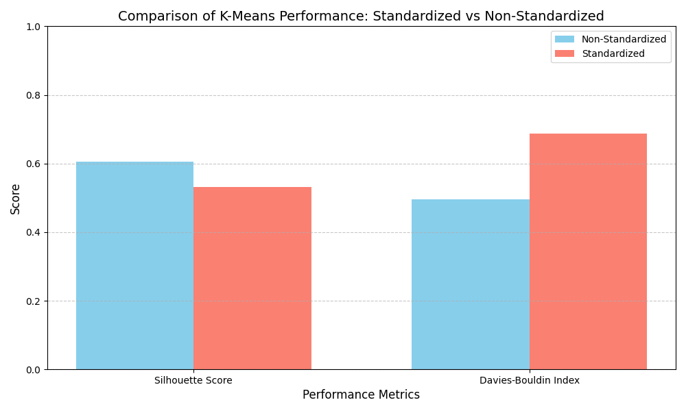
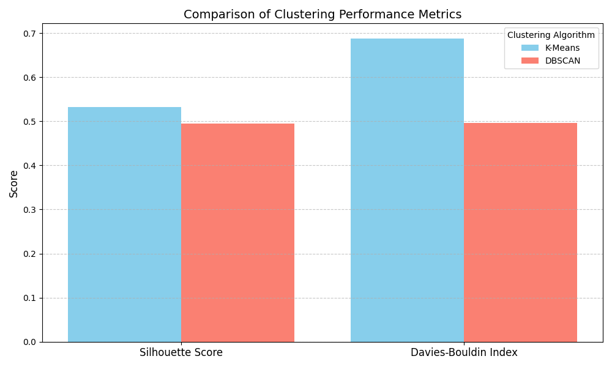

# **Clustering Algorithms on Product and Merchant Data**

This repository demonstrates the use of clustering algorithms, specifically K-Means and DBSCAN, to analyze product and merchant data. It includes Python scripts, datasets, and visualizations to explore the impact of standardization and algorithmic differences.

---

## **Datasets**

### **1. `pricerunner_aggregate 2.csv`**
- Contains information about products and merchants used for clustering.
- **Key Columns**:
  - `Product ID`
  - `Merchant ID`

### **2. Clustered Data Outputs**
- **`non-standardize_k-means_clustered_data.csv`**: Results of K-Means clustering without standardization.
- **`standardize_k-means_clustered_data.csv`**: Results of K-Means clustering with standardization.
- **`dbscan_clustered_data.csv`**: Results of DBSCAN clustering.

---

## **Python Scripts**

### **1. `non-standardize_k-means.py`**
- Implements K-Means clustering without standardizing the data.
- Outputs clustering performance metrics and visualizations.

### **2. `standardize_k-means.py`**
- Implements K-Means clustering with standardized data.
- Highlights the improvement in clustering performance after standardization.

### **3. `dbscan.py`**
- Applies the DBSCAN clustering algorithm.
- Includes performance metrics for non-standardized data.

---

## **Performance Metrics**

### **Silhouette Score**
- Measures how similar an object is to its cluster compared to other clusters.
- **Range**: `-1` (poor clustering) to `1` (ideal clustering).

### **Davies-Bouldin Index**
- Evaluates the compactness and separation of clusters.
- Lower values indicate better clustering.

---

## **Visualizations**

### Key Visualizations:
1. **K-Means vs DBSCAN Performance (Non-Standardized)**:
   

2. **Impact of Standardization on K-Means**:
   

3. **K-Means vs DBSCAN Performance (Standardized)**:
   

---

## **Installation**

1. Clone this repository:
   ```bash
   git clone https://github.com/<your_username>/<repository_name>.git
   cd <repository_name>
2. Install the required dependencies:
   ```bash
   pip install -r requirements.txt


